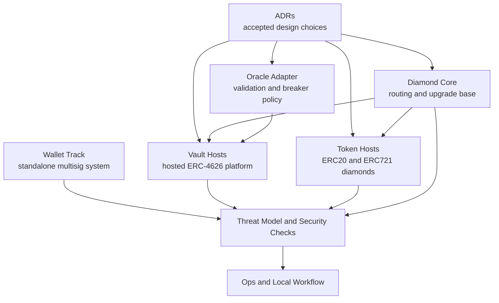

# Docs Map

This is the canonical documentation map for `Auralis`.

Use this surface to understand the current architecture, the major design
decisions behind it, how safety is validated, and where operator-facing
runbooks live.

The repo currently has three major protocol surfaces:

- diamond-hosted token systems
- diamond-hosted vault systems
- a standalone multisig wallet track

## Architecture Overview

## Start Here

- Architecture decisions: `docs/adr/README.md`
- Diamond core architecture: `docs/diamond-core.md`
- Hosted token architecture: `docs/token-facets.md`
- Hosted vault architecture: `docs/vault-facets.md`
- Smart-wallet architecture: `docs/multisig-wallet.md`
- Security assumptions: `docs/threat-model.md`
- Validation and CI policy: `docs/security-checks.md`

## Architecture

The linked architecture docs include structure and lifecycle diagrams where the
visual model materially improves comprehension.

- `docs/diamond-core.md`: diamond routing, cut flow, selector ownership, and
  storage discipline.
- `docs/token-facets.md`: separate ERC20 and ERC721 host model, initialization,
  role surface, and upgrade assumptions.
- `docs/vault-facets.md`: hosted vault facet split, selector ownership, and
  deployment model.
- `docs/multisig-wallet.md`: standalone multisig wallet deployment,
  authorization, and configuration model.
- `docs/erc4626-vault.md`: standalone ERC-4626 module semantics, math, fees,
  limits, and native-mode accounting assumptions.
- `docs/oracle-adapter.md`: oracle adapter validation, breaker behavior, and
  fallback policy.
- `docs/access-control.md`: RBAC hierarchy and time-window access model.
- `docs/pausable.md`: global and scoped pause behavior.
- `docs/reentrancy-guard.md`: reentrancy protection model.
- `docs/upgrade-guardrails.md`: queued upgrade intent model and execution
  constraints.

## ADRs

- `docs/adr/README.md`: accepted architecture decisions and their consequences.

## Security And Validation

- `docs/threat-model.md`: trust assumptions, threat boundaries, and residual
  risks.
- `docs/security-checks.md`: CI gates and local reproduction entrypoints.
- `docs/system-hardening.md`: system-level hardening coverage and what it
  intentionally simulates.
- `docs/testing-conventions.md`: test layout and naming conventions.

## Operations

- `docs/ops/README.md`: operator-facing runbooks and validation flows.
- `docs/ops/workflow-conventions.md`: issue, branch, PR, and milestone workflow expectations.
- `docs/ops/release-checklist.md`: release readiness, validation gates, and publish steps.
- `docs/ops/release-notes-template.md`: release note structure for tagged versions.

## Local Workflow

- `docs/auralis-local.md`: local bootstrap, smoke, activity, reset flow, and
  artifact layout.
