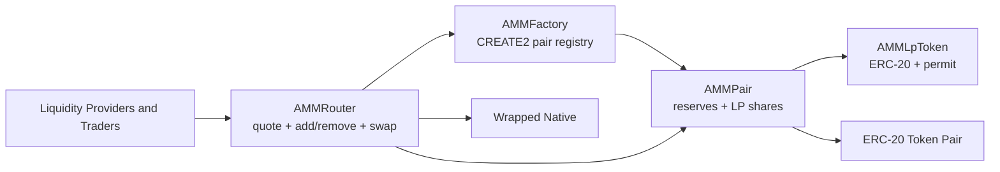

# AMM Track

This document is the canonical guide for the standalone V2-style AMM
architecture in `Auralis`.

The AMM track is intentionally separate from the repo's diamond-hosted token
and vault systems and from the standalone multisig wallet track. It exists to
show another protocol-style execution surface inside the repo: a
deterministic-pair, constant-product exchange with explicit liquidity,
wrapped-native routing, protocol-fee controls, and hardening coverage.

## Supported Model

The current AMM track supports:

- one `AMMFactory` registry for deterministic pair creation
- one `AMMRouter` user-facing quoting, liquidity, and swap surface
- one `AMMPair` implementation deployed per sorted token pair with `CREATE2`
- one ERC-20 + permit LP token base (`AMMLpToken`) for pair shares
- one wrapped-native token dependency for native add/remove/swap routes
- constant-product swaps with a fixed `0.3%` fee model
- explicit `skim` and `sync` handling for balance/reserve drift

It does not expose flash-swap callbacks or arbitrary swap hooks.

## Deployment Model

The AMM deployment flow is intentionally small:

1. deploy the wrapped-native contract used for native routes
2. deploy `AMMFactory`
3. deploy `AMMRouter` with the factory and wrapped-native addresses
4. create pairs either directly through `AMMFactory.createPair(...)` or lazily
   on first `addLiquidity(...)` / `addLiquidityNative(...)`

Important deployment properties:

- `AMMFactory` constructor sets `feeToSetter = msg.sender`
- pairs do not exist at factory/router deployment time
- pair addresses are deterministic from the sorted token tuple and
  `pairCodeHash()`
- the router only auto-creates a pair on liquidity-add flows; swap and remove
  flows require the pair to already exist

For this issue, the deployment surface is reviewer-facing documentation rather
than a new script package. The repo does not currently generate dedicated AMM
deployment artifacts or a managed AMM local stack.

## Pair Model

Each `AMMPair` is a standalone constant-product market between `token0` and
`token1`, where token ordering is address-sorted at creation.

Key mechanics:

- reserves are stored as `uint112` and updated explicitly through `_update(...)`
- raw ERC-20 balances and tracked reserves are intentionally separate
- the first liquidity event mints `MINIMUM_LIQUIDITY()` (`1000`) to the dead
  sink to prevent total-supply edge cases
- later liquidity mints are proportional to the current reserve ratio
- burns redeem underlying pro rata from the pair's current balances
- `skim(...)` transfers only surplus over tracked reserves
- `sync()` forces tracked reserves to current balances

The pair also maintains:

- `price0CumulativeLast`
- `price1CumulativeLast`
- `kLast`

Cumulative prices advance only when time has elapsed and both reserves are
nonzero. They are raw V2-style fixed-point building blocks, not a full oracle
policy by themselves.

## Router Model

`AMMRouter` is the user-facing surface for:

- quoting via `quote`, `getAmountOut`, `getAmountIn`
- multi-hop path traversal via `getAmountsOut`, `getAmountsIn`
- token-token liquidity adds and removals
- token-native liquidity adds and removals
- exact-in and exact-out token swap routes
- exact-in and exact-out native swap routes
- LP permit-assisted removal flows

Native-route rules are explicit:

- wrapped-native must be the first path entry for native-in swaps
- wrapped-native must be the last path entry for native-out swaps
- the router only accepts raw native asset from the configured wrapped-native
  contract
- unused native value is refunded on `addLiquidityNative(...)` and
  `swapNativeForExactTokens(...)`

## Math Notes

The AMM uses the standard constant-product shape with a fixed fee:

- fee denominator: `1000`
- fee numerator for swap input: `997`
- effective swap fee: `0.3%`

On swap, the pair enforces the adjusted-balance invariant:

- `balance0Adjusted = balance0 * 1000 - amount0In * 3`
- `balance1Adjusted = balance1 * 1000 - amount1In * 3`
- `balance0Adjusted * balance1Adjusted >= reserve0 * reserve1 * 1000^2`

Protocol-fee behavior is optional and factory-controlled:

- fee minting is off when `feeTo == address(0)`
- when `feeTo` is set, a later liquidity event may mint protocol LP based on
  growth in `sqrt(k)`
- `kLast` refreshes on fee-on liquidity events
- disabling `feeTo` clears `kLast` on the next liquidity event

## Security Notes

The AMM track is opinionated about what it supports and what it rejects.

Notable guard rails:

- pair write paths use a lock to block reentrant execution
- `swap(...)` rejects zero-output swaps, invalid recipients, and any nonempty
  swap callback data
- pair transfers use low-level ERC-20 calls and treat only empty return data or
  decoded `true` as success
- router transfer helpers apply the same success policy for token moves
- router path validation rejects malformed or missing wrapped-native boundaries
- zero-address and identical-token inputs are rejected at sort/lookup
- pair reserve writes revert on `uint112` overflow

Reviewer expectations:

- malformed, false-returning, silent, and reentrant token behaviors are part of
  the tested hardening surface
- cumulative prices should be treated as low-level accounting outputs, not as a
  complete production oracle or manipulation-resistant pricing policy

## Reviewer Path

Start with:

- `README.md`
- `docs/README.md`
- `docs/threat-model.md`

Architecture and behavior:

- `docs/amm.md`
- `src/amm/AMMFactory.sol`
- `src/amm/AMMPair.sol`
- `src/amm/AMMRouter.sol`

Bounded reviewer-facing validation:

- `test/AMMFoundationCore.t.sol`
- `test/AMMFactoryRegistry.t.sol`
- `test/AMMPairCore.t.sol`
- `test/AMMRouterCore.t.sol`
- `test/AMMRouterTime.t.sol`

Hardening and adversarial validation:

- `test/AMMPairFuzz.t.sol`
- `test/AMMRouterFuzz.t.sol`
- `test/AMMInvariant.t.sol`
- `test/AMMHardening.t.sol`

## Out Of Scope For V1

The current AMM track does not include:

- flash-swap callbacks
- concentrated liquidity
- custom routing hooks
- onchain governance or timelock policy around `feeToSetter`
- dedicated local deployment scripts or artifact files for AMM-only stacks
- downstream oracle-consumer policy built on the cumulative price fields
