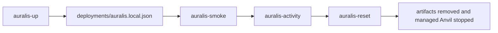

# Auralis Local Workflow

`Auralis` ships with a local-first workflow for bootstrapping the token hosts,
ERC20 vault host, native vault host, and a small amount of simulated protocol
activity on Anvil.

The standalone AMM track is currently documented as a reviewer-facing,
test-first local flow rather than a managed deployment script stack.

## Prerequisites

- `anvil`
- `forge`
- `cast`
- Python 3

Set `PRIVATE_KEY` and `ALICE_PRIVATE_KEY` to funded local Anvil account keys
before running the scripts. For local-only testing, use keys from Anvil's
startup output; never use funded network keys.

## Commands

Bootstrap the full local environment:

```shell
bash scripts/auralis-up.sh
```

Smoke-check the deployed stack:

```shell
bash scripts/auralis-smoke.sh
```

Generate simulated local activity:

```shell
bash scripts/auralis-activity.sh
```

Reset local artifacts and stop the managed Anvil process:

```shell
bash scripts/auralis-reset.sh
```

## Workflow Overview



## What The Scripts Do

`auralis-up.sh`
- starts Anvil if one is not already available
- deploys the ERC20 host, ERC721 host, ERC20 vault host, and native vault host
- writes the host-specific vault artifacts and `deployments/auralis.local.json`

`auralis-smoke.sh`
- checks deployed code is present
- runs token and NFT happy-path transactions
- runs ERC20 vault deposit, strategy deploy, profit sync, manager pull, user auto-pull, and emergency-exit flows
- runs native vault exact-value deposit and mint, strategy deploy, payable
  profit sync, manager pull, user auto-pull, emergency-exit, and strategy
  rebind flows
- restores both local vaults to a ready state by re-binding the configured strategy after the emergency-exit smoke
- verifies both vault oracle quote paths are live

`auralis-activity.sh`
- generates deterministic demo traffic across the deployed hosts
- mints and transfers ERC20 balances
- mints and moves an ERC721 token
- deposits into the ERC20 vault and native vault, deploys capital to strategy, syncs profit, pulls funds back, moves shares, redeems shares, updates the oracle, and toggles pause state

`auralis-reset.sh`
- stops the managed Anvil process if `auralis-up.sh` started it
- removes the Auralis deployment artifacts, including the native vault artifact

## Artifact Layout

`deployments/auralis.local.json` combines the host-specific deployment outputs
and records:

- RPC URL
- chain id
- owner/alice actor addresses
- ERC20 host addresses
- ERC721 host addresses
- ERC20 vault host addresses
- native vault host addresses
- configured vault strategy addresses and zeroed initial strategy state

The host-specific vault artifacts are:

- `deployments/diamond-vault.local.json`
- `deployments/diamond-native-vault.local.json`

Each vault artifact records:

- `assetMode` as `erc20` or `native`
- the installed facet addresses, including `vaultNativeFacet`
- the configured strategy and zeroed initial strategy state

For backward compatibility:

- `vaultHost` in `deployments/auralis.local.json` remains the ERC20 hosted
  vault
- `nativeVaultHost` is the parallel native hosted vault entry

## Simulated Activity

The activity script is explicitly demo traffic for local development and review.
It is meant to create realistic event history and state transitions, not to
model production usage or strategy execution.

For the native hosted vault specifically, the local workflow assumes:

- asset-in flows use `depositNative` and `mintNative`
- `mintNative` must be funded with exact `msg.value`
- exits use standard `withdraw` and `redeem` and pay raw native asset
- strategy profit injection is payable and uses raw ETH
- force-sent ETH is not treated as managed assets by the vault accounting model

## Standalone AMM Track

The AMM subsystem is intentionally separate from `auralis-up.sh` and the
diamond-hosted local stack.

Today, the local AMM review path is:

- read `docs/amm.md` for the deployment model, math, and security notes
- use the AMM Foundry suites as the executable deployment and validation path
- treat wrapped-native deployment, factory deployment, router deployment, and
  first-pair creation as the canonical AMM bring-up order

The deployment reasoning order is:

1. deploy the wrapped-native dependency
2. deploy `AMMFactory`
3. deploy `AMMRouter`
4. create pairs directly through the factory or lazily via the first liquidity
   add flow

The bounded local reviewer path is:

```shell
forge test --offline --match-path test/AMMFoundationCore.t.sol
forge test --offline --match-path test/AMMFactoryRegistry.t.sol
forge test --offline --match-path test/AMMPairCore.t.sol
forge test --offline --match-path test/AMMRouterCore.t.sol
forge test --offline --match-path test/AMMRouterTime.t.sol
```

For the fuller AMM hardening path:

```shell
forge test --offline --match-path test/AMMPairFuzz.t.sol
forge test --offline --match-path test/AMMRouterFuzz.t.sol
FOUNDRY_INVARIANT_RUNS=64 FOUNDRY_INVARIANT_DEPTH=32 forge test --offline --match-path test/AMMInvariant.t.sol
forge test --offline --match-path test/AMMHardening.t.sol
```

The repo does not currently write a dedicated AMM deployment artifact file for
this track.
