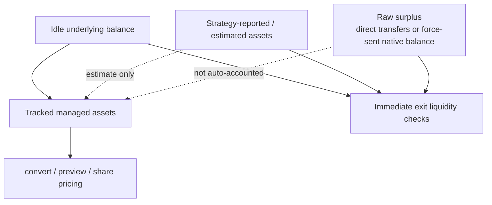

# ERC-4626 Vault

This document describes how to integrate and review the vault modules in this
repository:
- `ERC4626VaultBase`
- `ERC4626Vault`
- `ERC4626VaultControls`

For the accounting and native-asset decisions behind this module family, see
`docs/adr/0003-tracked-managed-assets.md`,
`docs/adr/0004-native-sentinel-and-facet.md`, and
`docs/adr/0005-exclude-force-sent-eth.md`.

It covers the standalone vault modules and their math/control behavior. For the
diamond-hosted vault platform, see `docs/vault-facets.md`. For the hosted
ERC-7540 async request track, see `docs/erc7540-vault.md`.

## Accounting Model



Native-asset mode is only supported through the diamond-hosted vault platform.
The standalone `ERC4626Vault` module remains an ERC-20 asset vault surface.
The standalone module also remains synchronous: it does not implement
controller-scoped async requests, manager settlement, or claimable request
buckets.

## Contract Roles

- `ERC4626VaultBase`: initializer + share/asset accounting primitives.
- `ERC4626Vault`: ERC-4626 core user flows.
- `ERC4626VaultControls`: optional controls layer (fees, limits, pause,
  reentrancy guard, manager role).

## Usage Flows

### Deposit

- Caller transfers `assets` into vault and receives minted shares.
- `receiver` receives shares.
- Reverts on zero assets, zero receiver, or when computed shares are zero.

### Mint

- Caller requests exact `shares` and vault computes required assets.
- `receiver` receives shares.
- Reverts on zero shares, zero receiver, or when computed assets are zero.

### Withdraw

- Caller requests exact `assets` to send to `receiver`.
- Shares are burned from `owner`.
- If `msg.sender != owner`, caller must have enough share allowance.

### Redeem

- Caller burns exact `shares` from `owner`.
- Vault returns assets to `receiver`.
- If `msg.sender != owner`, caller must have enough share allowance.

## Permission Expectations

Core flows (`deposit`, `mint`, `withdraw`, `redeem`) are public user flows.
Access is constrained by balance and allowance rules, not an admin role.

Control-plane functions are role-gated in `ERC4626VaultControls`:
- `setFeeConfig(...)` requires `VAULT_MANAGER_ROLE`.
- `setLimitConfig(...)` requires `VAULT_MANAGER_ROLE`.
- `pause()` / `unpause()` require `PAUSER_ROLE` (from `Pausable`).

When paused, `deposit`, `mint`, `withdraw`, and `redeem` revert.

## Conversion Math and Rounding

Vault conversions use tracked managed assets (`totalManagedAssets`) and share
supply (`totalSupply`).

If `supply == 0` or `managedAssets == 0`, conversions bootstrap 1:1.

Formulas:

```text
shares = assets * supply / managedAssets
assets = shares * managedAssets / supply
```

Rounding direction by function:
- `convertToShares`: down
- `convertToAssets`: down
- `previewDeposit`: down
- `previewMint`: up
- `previewWithdraw`: up
- `previewRedeem`: down

## Fee Application Order (`ERC4626VaultControls`)

Deposit and mint use deposit fee:
- `deposit(assets)`: fee is computed from gross assets, then net assets are
  converted to shares.
- `mint(shares)`: required net assets are computed first, then gross assets are
  computed with fee gross-up.

Withdraw and redeem use withdraw fee:
- `withdraw(assetsOut)`: requested net assets are grossed-up before share burn.
- `redeem(shares)`: gross assets from shares are computed first, then net
  receiver assets are derived by subtracting fee.

Fee rounding:
- Deposit fee on raw assets rounds down.
- Withdraw fee on requested net assets rounds up.
- Withdraw fee on gross redeem amount rounds down.

## Limits and Cap Behavior (`ERC4626VaultControls`)

- `maxDeposit` and `maxMint` are reduced by per-call limits and by remaining
  `maxTotalAssets` capacity.
- `maxWithdraw` and `maxRedeem` are reduced by per-call limits.
- Limit value `0` means unlimited for that specific limit.
- Exceeding limits reverts with typed custom errors.

## Threat-Model Notes

### Donation / direct-transfer behavior

`totalAssets()` uses `totalManagedAssets`, not raw token balance. Direct token
donations do not inflate share price through conversion math.

Implication:
- Donation-style PPS manipulation is reduced.
- Extra donated tokens are not automatically accounted into managed assets.

### Rounding exploitation surface

Rounding is deterministic and favors conservative previews (`mint`/`withdraw`
round up, `deposit`/`redeem` round down). Very low-liquidity states can create
small edge losses due to integer math. Tests cover these boundary cases.

### Emergency controls

When `ERC4626VaultControls` is used, pause state blocks all four mutating
vault entrypoints. This is the primary emergency stop for vault write paths.

## Known Limitations and Assumptions

- `_mulDiv` uses direct `x * y` math, so unrealistic extreme values can overflow.
- `totalManagedAssets` assumes integrators use canonical vault flows for
  accounting updates.
- No native slippage parameters are present on ERC-4626 functions; integrators
  should pre-check previews and enforce client-side constraints.
- The controls layer applies global limits, not per-user risk limits.

## Hosted Native-Mode Boundary

The hosted platform extends this ERC-20 vault model with an ERC-7535-style
native entry surface, but the native behavior is not part of the standalone
module contract described here.

Implications:
- `deposit` and `mint` remain ERC-20 entrypoints only.
- native funding, exact `msg.value` validation, and raw native payouts are
  documented in `docs/vault-facets.md`.
- async request flows, settlement, and controller/operator semantics are
  documented in `docs/erc7540-vault.md`.
- forced native transfers are a hosted-vault accounting concern, not a
  standalone ERC-20 vault concern.

## Test References

- Core: `test/ERC4626Core.t.sol`
- Controls: `test/ERC4626VaultControlsCore.t.sol`
- Fuzz: `test/ERC4626VaultAccountingFuzz.t.sol`
- Invariant: `test/ERC4626VaultAccountingInvariant.t.sol`
