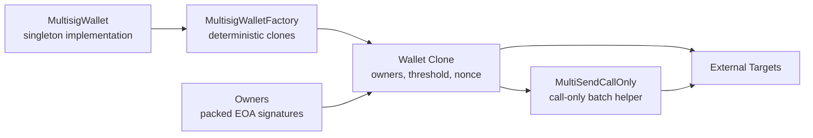

# Multisig Wallet

This document is the canonical guide for the standalone multisig wallet
architecture in `Auralis`.

The wallet track is intentionally separate from the repo's diamond-hosted token
and vault systems. It exists to show a second security-oriented protocol shape:
an account-style execution surface built around threshold approvals, replay
protection, deterministic deployment, and self-managed configuration.

## Supported Model

The current wallet track supports:

- one `MultisigWallet` singleton implementation
- one `MultisigWalletFactory` for deterministic clone deployment
- one fixed `MultiSendCallOnly` helper for atomic call-only batching
- EOA owners only
- one monotonic nonce shared across single-call and batch execution

## Deployment Model

Wallet instances are deployed as deterministic clones of the singleton
implementation.

Initialization sets:

- the initial owner set
- the threshold
- the fixed `MultiSendCallOnly` helper address
- the wallet nonce at `0`

The implementation contract is constructor-locked so only clones can be
initialized.

## Authorization Model

Single-call execution uses an EIP-712 typed payload containing:

- `to`
- `value`
- `dataHash`
- `nonce`

Batch execution uses an EIP-712 typed payload containing:

- `transactionsHash`
- `nonce`

Approvals are provided as one packed `bytes signatures` blob:

- one 65-byte ECDSA signature per approving owner
- exactly `threshold` signatures
- recovered signer addresses must be strictly increasing

This gives the wallet an explicit duplicate-signer and signer-order check
without relying on per-call deduplication storage.

## Execution And Replay Protection

The wallet exposes two execution surfaces:

- `executeTransaction(...)` for one external `call`
- `executeBatch(...)` for atomic call-only batching through the fixed helper

Replay protection is nonce-based:

- the current nonce is part of the signed payload
- signatures authorize only the current nonce
- nonce is advanced before external execution, so successful calls consume the
  approval and reverted calls cannot partially execute

The batch path does not expose arbitrary user delegatecall. The wallet
delegatecalls only into the fixed `MultiSendCallOnly` helper, which then issues
plain external calls to the batched targets.

## Configuration Model

Wallet configuration is self-managed.

The wallet exposes direct configuration methods:

- `addOwner(address)`
- `removeOwner(address)`
- `replaceOwner(address,address)`
- `changeThreshold(uint256)`

Those methods are only callable by the wallet itself. In practice, that means
configuration changes must be executed through an already-authorized
`executeTransaction(...)` or `executeBatch(...)` call.

Removal uses swap-and-pop on the owner array. Owner ordering is not part of the
public contract guarantee.

## Out Of Scope For V1

The current wallet track does not include:

- modules or guards
- fallback handlers
- contract-owner signatures
- ERC-4337 integration
- passkeys
- gas refund machinery
- generic user delegatecall execution

## Related Tests

- `test/MultisigWalletFoundationCore.t.sol`
- `test/MultisigWalletCoreExecution.t.sol`
- `test/MultisigWalletFuzz.t.sol`
- `test/MultisigWalletIntegration.t.sol`
- `test/MultisigWalletManagement.t.sol`
- `test/MultisigWalletInvariant.t.sol`

`test/MultisigWalletFuzz.t.sol` is the signature/threshold/nonce fuzz evidence:
it exercises sorted threshold signatures, malformed lengths, invalid signers,
wrong nonces, replay rejection, target reverts, and batch execution.
