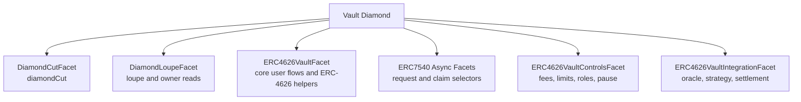
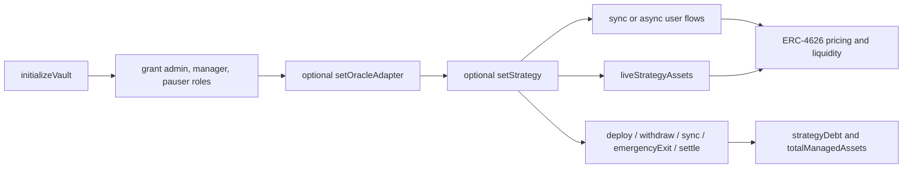

# Diamond Vault Facets

This document is the canonical guide for the hosted vault architecture in
`Auralis`.

For the durable architecture decisions behind the hosted vault shape, see
`docs/adr/0002-separate-diamond-hosts.md`,
`docs/adr/0003-tracked-managed-assets.md`,
`docs/adr/0004-native-sentinel-and-facet.md`, and
`docs/adr/0005-exclude-force-sent-eth.md`.

It covers the supported diamond-hosted vault family:

- synchronous ERC-20 hosts
- synchronous native hosts
- async ERC-20 hosts with ERC-7540-style request flows
- one active strategy per vault

For the standalone ERC-4626 module behavior and math reference, see
`docs/erc4626-vault.md`. For the async request lifecycle and reviewer entry
surface, see `docs/erc7540-vault.md`.

## Supported Host Model

The hosted vault diamond preserves a split between user-facing vault flows,
control-plane selectors, async request selectors when installed, and
integration/config selectors.

### Host Structure

### Core Facet

`ERC4626VaultFacet` owns the initialization, accounting, and share-token base
surface. The exact selector group depends on the host variant:

- synchronous ERC-20 host:
  - `deposit`, `mint`, `withdraw`, `redeem`
  - conversion, preview, and `max*` helpers
- async-deposit host:
  - `withdraw`, `redeem`
  - conversion and async-redeem-facing helpers
- fully async host:
  - initialization, metadata, share-token flows, `asset()`,
    `totalManagedAssets()`, `totalAssets()`, `convertToShares()`, and
    `convertToAssets()`

Across the family, the core facet owns:

- vault initialization
- share metadata and share-token flows
- `asset()` and `totalManagedAssets()`

The core facet also owns runtime liquidity sourcing for user withdrawals and
redemptions. When idle vault liquidity is insufficient, it will pull
immediately withdrawable assets from the configured strategy before finishing
`withdraw` or `redeem`.

### Async Request Facets

ERC-20 hosted vaults can install async request selectors:

- `ERC7540VaultDepositFacet`:
  - `requestDeposit`
  - pending/claimable deposit request views
  - operator approvals
  - async-claim-aware `deposit`, `mint`, `maxDeposit`, and `maxMint`
- `ERC7540VaultRedeemFacet`:
  - `requestRedeem`
  - pending/claimable redeem request views
  - async-claim-aware `withdraw`, `redeem`, `maxWithdraw`, and `maxRedeem`

The aggregate request model and exact async lifecycle are documented in
`docs/erc7540-vault.md`.

### Native Facet

`ERC7535VaultFacet` owns the native-only selector group:

- `depositNative(address receiver)`
- `mintNative(uint256 shares, address receiver)`

It exists only for hosted vaults initialized with the native asset sentinel:

- `0xEeeeeEeeeEeEeeEeEeEeeEEEeeeeEeeeeeeeEEeE`

Native mode keeps the standard ERC-4626 surface unchanged:

- `deposit` and `mint` remain installed on the core facet but revert for native
  vaults
- `withdraw` and `redeem` stay on the core facet and pay raw native asset in
  native mode

### Controls Facet

`ERC4626VaultControlsFacet` owns the control-plane selector group:

- fee config and limit config
- access control and time-window role selectors
- global and scoped pause selectors
- reentrancy introspection
- `supportsInterface(bytes4)`

### Integration Facet

`ERC4626VaultIntegrationFacet` owns the integration/config selector group:

- oracle adapter reference
- strategy reference and emergency-exit state
- strategy lifecycle methods
- async settlement methods when the async request track is installed
- `idleAssets()`
- `liveStrategyAssets()`
- `strategyDebt()`
- `oracleQuote()`

The integration facet is the manager-facing strategy surface. It does not own
vault initialization and it does not own user ERC-4626 entrypoints.

When async selectors are installed, the integration facet also owns:

- `ASYNC_SETTLEMENT_SCOPE()`
- `settleDepositRequest(address controller, uint256 assets)`
- `settleRedeemRequest(address controller, uint256 shares)`

## Initialization And Deployment Model

The hosted vault uses one initializer on the core facet only.

Initialization sequence:

1. Install loupe selectors.
2. Install the core, controls, and integration selector groups.
3. For async ERC-20 hosts, also install the async request selector groups.
4. For native mode, also install the native selector group.
5. Call
   `initializeVault(address vaultAsset, string vaultName, string vaultSymbol, address admin)`
   through the diamond.
6. Call `setOracleAdapter(address newAdapter)` through the integration facet.
7. Call `setStrategy(address newStrategy)` through the integration facet.

Initialization behavior:

- `initializeVault(...)` initializes vault storage and shared control storage.
- `DEFAULT_ADMIN_ROLE`, `PAUSER_ROLE`, and `VAULT_MANAGER_ROLE` are granted to
  `admin`.
- `feeRecipient` defaults to `admin` at initialization.
- `ERC4626VaultControlsFacet` has no independent initializer.
- `ERC4626VaultIntegrationFacet` has no independent initializer.
- a second call to `initializeVault(...)` reverts.

The local reference deployment in `script/DeployDiamondVaultHost.s.sol` wires a
vault-bound, asset-bound strategy by default. It leaves the vault in a ready
state with:

- `strategy()` configured
- `strategyDebt() == 0`
- `liveStrategyAssets() == 0`
- `strategyEmergencyExit() == false`

No funds are deployed to strategy during deployment.

The native local reference deployment in `script/DeployDiamondNativeVaultHost.s.sol`
uses the same init model, but passes the native asset sentinel as
`vaultAsset` and installs the native selector group.

## Role Model And Pause Behavior

Hosted vault facets reuse the shared control plane.

### Roles

- `DEFAULT_ADMIN_ROLE`
- `PAUSER_ROLE`
- `VAULT_MANAGER_ROLE`

`VAULT_MANAGER_ROLE` is used for:

- `setFeeConfig(...)`
- `setLimitConfig(...)`
- `setOracleAdapter(...)`
- `setStrategy(...)`
- `deployToStrategy(...)`
- `withdrawFromStrategy(...)`
- `syncStrategyAssets()`
- `emergencyExitStrategy()`
- `settleDepositRequest(...)` when async deposit selectors are installed
- `settleRedeemRequest(...)` when async redeem selectors are installed

### Pause Behavior

The hosted vault currently uses a global pause model for request and claim
entrypoints, plus a dedicated settlement scope when async selectors are
installed.

Global pause blocks:

- `deposit`
- `mint`
- `depositNative`
- `mintNative`
- `withdraw`
- `redeem`
- `requestDeposit`
- `requestRedeem`

Global pause does not block share-token flows:

- `approve`
- `transfer`
- `transferFrom`

Scoped pause selectors still route through the controls facet, but the hosted
vault does not currently use per-scope pause behavior for ERC-4626 request or
claim entrypoints.

When the async request track is installed:

- `ASYNC_SETTLEMENT_SCOPE` gates manager settlement only
- pausing that scope blocks `settleDepositRequest` and `settleRedeemRequest`
- already-claimable requests remain claimable while settlement is scope-paused

## Strategy Model

The hosted vault strategy model is intentionally narrow:

### Runtime Flow

- one active strategy per vault
- single-asset only
- strategy instance is vault-bound and asset-bound
- no allocator or multi-strategy routing
- no automatic harvest or keeper loop
- async request support is controller-scoped and aggregate-id based rather than
  per-request queue based

A strategy must satisfy `IERC4626VaultStrategy` and report:

- `vault() == address(diamond)`
- `asset() == asset()`

`setStrategy(...)` validates those bindings and requires `strategyDebt() == 0`
before a strategy can be cleared or replaced.

For native hosted vaults, `asset()` on both the vault and the strategy must be
the native sentinel. No separate native-only strategy interface exists.

### Lifecycle Surface

Manager lifecycle methods live on the integration facet:

- `setStrategy(address)`
- `deployToStrategy(uint256)`
- `withdrawFromStrategy(uint256)`
- `syncStrategyAssets()`
- `emergencyExitStrategy()`
- `settleDepositRequest(address controller, uint256 assets)` when async deposit
  selectors are installed
- `settleRedeemRequest(address controller, uint256 shares)` when async redeem
  selectors are installed

Behavior:

- `deployToStrategy(...)` moves idle assets from the vault into strategy and
  increases `strategyDebt()` by the deployed amount.
- `withdrawFromStrategy(...)` pulls assets back from strategy, may return less
  than requested, and realizes any gain or loss into book value.
- `syncStrategyAssets()` realizes mark-to-market strategy profit or loss into
  book value without moving idle assets.
- `emergencyExitStrategy()` sets the sticky emergency-exit flag before trying a
  full unwind.

Emergency exit is one-way for the current strategy instance:

- once emergency exit is active, new deploys are blocked
- if unwind succeeds, debt is reconciled down to the remaining live strategy
  assets
- if unwind reverts, emergency exit stays active and the call does not revert
- to resume deploying, the manager must get debt to zero and then clear or
  replace the strategy

## Accounting Model

The hosted vault separates book accounting from live pricing.

Book accounting:

- `totalManagedAssets()` is the vault's stored book value
- `strategyDebt()` is the book debt allocated to the configured strategy
- `idleAssets()` is the underlying currently held by the vault

Live pricing:

- `liveStrategyAssets()` is the strategy's current mark-to-market value
- hosted `totalAssets()` is priced as:
  `idleAssets() + liveStrategyAssets()`

Operationally:

- after deploys, book value stays constant and debt increases
- after manager pulls, syncs, or emergency exit, realized profit or loss is
  written into `totalManagedAssets()` and `strategyDebt()` is updated to the
  post-operation live strategy assets
- when no strategy is configured or debt is zero, hosted pricing collapses back
  to idle vault assets

This means the hosted vault uses live strategy pricing for ERC-4626 conversions
while still keeping explicit book accounting for deployed debt.

## Async Request Model

The ERC-20 hosted vault track supports controller-scoped async requests.

### Async Deposits

- `requestDeposit` transfers assets into the vault and increases the
  controller's pending deposit bucket
- pending and claimable deposit assets are excluded from managed assets until
  claim
- a manager settles deposits through the integration facet
- the controller or its approved operator claims settled deposits through the
  async deposit facet's `deposit` or `mint` entrypoints

### Async Redeems

- `requestRedeem` escrows shares in the vault and increases the controller's
  pending redeem bucket
- settled redeem requests become claimable by the controller
- claim execution burns escrowed shares only at claim time
- async redeem claims may source immediately withdrawable strategy liquidity
  before paying the receiver

### Reviewer Notes

- the only supported request id is the aggregate id `0`
- async preview helpers revert instead of estimating unsettled future pricing
- `maxDeposit`, `maxMint`, `maxWithdraw`, and `maxRedeem` become
  claimable-aware when async selectors are installed
- native hosted vaults remain synchronous and do not install this async surface

## User-Facing Withdraw And Redeem Semantics

### Native-Asset User Flows

Native hosted vaults use the ERC-7535-style entry surface for asset-in flows.

#### `depositNative(receiver)`

- caller sends raw native asset as `msg.value`
- shares are minted from the same fee/limit/pause logic used by hosted
  `deposit`
- the vault asset remains the sentinel address, not wrapped native token state

#### `mintNative(shares, receiver)`

- caller requests exact `shares`
- the vault computes the gross native assets required under current fee logic
- `msg.value` must equal that required gross amount exactly
- underpayment reverts
- overpayment also reverts
- no refund path, excess credit, or donation semantics are supported

#### `withdraw(assets)` and `redeem(shares)` in native mode

- user exits remain on the standard ERC-4626 core facet
- payouts are sent as raw native asset
- if idle liquidity is short, the vault may auto-pull immediately withdrawable
  native liquidity from strategy before paying the receiver

## Native-Asset Accounting And Safety Assumptions

Hosted native vaults still use tracked managed assets rather than raw
`address(this).balance`.

Implications:
- force-sent ETH does not increase `totalManagedAssets()`
- force-sent ETH does not increase share price through `totalAssets()` pricing
- force-sent ETH does not increase hosted `maxWithdraw()` or `maxRedeem()`
- if a native exit is satisfied partly or fully from untracked force-sent ETH,
  book accounting only burns the tracked portion of assets

This is an explicit safety choice:
- untracked native surplus is treated as non-canonical balance
- native integrators should not rely on arbitrary ETH transfers into the vault
  to represent managed assets
- the vault does not attempt to reconcile unsolicited ETH into strategy debt or
  book value automatically

`withdraw(assets)` and `redeem(shares)` remain core-facet entrypoints, but they
are strategy-aware.

### `withdraw(assets)`

- exact-assets semantics are preserved
- if idle vault assets are insufficient, the core facet automatically pulls
  immediately withdrawable strategy liquidity
- if the requested assets still cannot be sourced after realizing any loss, the
  call reverts

### `redeem(shares)`

- exact-shares semantics are preserved
- the vault burns the requested shares and returns the current post-loss asset
  value of those shares
- if strategy liquidity must be sourced first, the vault pulls it before final
  asset calculation and transfer

### `max*` Helpers

- `maxDeposit()` and `maxMint()` remain strategy-aware through live `totalAssets()`
  pricing and limit shaping
- `maxWithdraw()` and `maxRedeem()` are bounded by immediate liquidity, not by
  total mark-to-market assets alone
- in native mode, immediate liquidity excludes untracked force-sent ETH above
  tracked idle assets
- `maxWithdraw()` and `maxRedeem()` are zero when `totalAssets() == 0`, even if
  residual dust shares still exist after a full loss event

## Selector Ownership Model

For the supported hosted vault deployment:

- `diamondCut` is owned by `DiamondCutFacet`
- loupe and ownership-introspection selectors are owned by `DiamondLoupeFacet`
- core selectors are owned by `ERC4626VaultFacet`
- native selectors are owned by `ERC7535VaultFacet` when native mode is
  installed
- controls selectors and `supportsInterface(bytes4)` are owned by
  `ERC4626VaultControlsFacet`
- integration selectors are owned by `ERC4626VaultIntegrationFacet`

One important implication:

- support for `IERC4626VaultFacet` and `IERC4626VaultIntegrationFacet` is
  reported through the controls facet
- support for `IERC7535VaultFacet` is only reported when native selectors are
  installed
- those interface IDs are only reported when the corresponding core or
  integration selectors are installed

## Storage And Upgrade Assumptions

Hosted vault state lives in the diamond, not in facet bytecode.

Supported replace/remove/re-add flows assume:

- replacement facets preserve the same storage layout
- selectors are restored before the corresponding surface is expected to route
- no re-initialization is performed during upgrades

Current hardening coverage explicitly validates persistence for:

- vault metadata and ERC-4626/share-token state
- fee config, limit config, roles, role windows, and pause state
- oracle adapter, strategy address, strategy debt, live strategy assets, and
  emergency-exit state

## Deployment References

Reference local deployment flow:

- `script/DeployDiamondVaultHost.s.sol`
- `script/DeployDiamondNativeVaultHost.s.sol`

Reference deployment-backed validation:

- `test/DiamondVaultDeploymentIntegration.t.sol`
- `test/ERC7540VaultFoundationCore.t.sol`
- `test/ERC7540VaultDepositCore.t.sol`
- `test/ERC7540VaultRedeemCore.t.sol`
- `test/ERC4626VaultIntegrationFacetCore.t.sol`
- `test/ERC4626VaultStrategyAccountingCore.t.sol`
- `test/VaultStrategyFoundationCore.t.sol`
- `test/DiamondVaultHostHardening.t.sol`
- `test/DiamondVaultHostInvariant.t.sol`
- `test/DiamondNativeVaultHostHardening.t.sol`
- `test/DiamondNativeVaultHostInvariant.t.sol`

## Out Of Scope

The current hosted strategy model does not include:

- multi-strategy allocation
- automatic harvest or keeper-driven execution
- wrapping native balances into WETH or another canonical ERC-20 asset inside
  the hosted vault
- per-request queue ids or FIFO claim ordering for the async request track
- extension-standard work deferred to `#24 Advanced Extensions`
